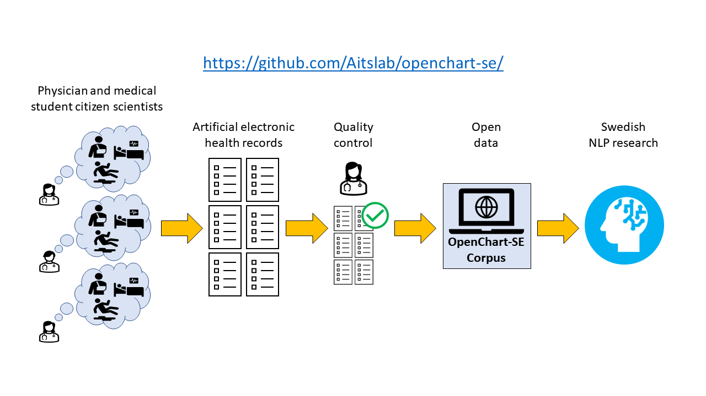

# OpenChart-SE

Every year hundreds of thousands of patients are treated in Swedish hospitals. By studying them thoroughly, we could gain many new insights into disease conditions, e.g. learn to predict disease outcomes, understand common symptom combinations or detect adverse effects. To do this, we would need to systematically go through the patients’ electronic health records and extract information about prior diseases and medications, symptoms and other patient characteristics. Unfortunately, it is not possible to do this manually as the amount of text that needs to be processed far exceeds the resources available for research.
Artificial intelligence models trained to extract specific types of information, such as symptoms, could help with this. To train such models, we need to have patient health records as training material. However, real health records are highly sensitive in their nature and cannot be shared openly. To solve this problem, we want to generate a collection of “fake” electronic health records, written by real Swedish health care professionals or medical students about imaginary patients. These can then be shared openly with researchers and used to train and evaluate a variety of artificial intelligence models without any privacy concerns. These models will learn the language typically used by Swedish health care professionals and can then be used on real patient records after appropriate evaluation and ethical approval.

## Participating in the project
If you are a health care professional or medical student in Sweden, you can help create this valuable resource by filling in one or several “fake” electronic health records [here](http://openchart.noacs.io). 

The data that is submitted will be reviewed by an experienced Swedish emergency care physician. After that it is added to the "data" folder in this repo.

You can remain anonymous or submit your contact details, if you want to be acknowledged, and receive feedback and information about the release of the dataset.

For more information, please contact the project leader Sonja Aits (sonja.aits [at] med.lu.se).

## Dataset

The OpenChart-SE corpus containing the submitted artificial EHRs that have passed quality control can be found in the "data" folder. 

### Data release history
#### 2022-12-19

OpenChart-SE corpus, version 1, released in this repo and on Zenodo, [https://zenodo.org/record/7499831#.Y7Rs4BXMJEY](https://zenodo.org/record/7499831#.Y7Rs4BXMJEY)

50 records

#### 2023-01-03
OpenChart-SE preprint released in this repo (openchart-se_v2.pdf)

## Article
Our pre-print article describing the OpenChart-SE project has been submitted to a preprint server. Supplemental data for the preprint in the "data" folder.

## Licensing

Please cite our preprint and our dataset when using the artificial EHR data from the OpenChart-SE corpus and/or code in this repo. The data and code in this repo is identical with that published on zenodo [https://doi.org/10.5281/zenodo.7499831](https://doi.org/10.5281/zenodo.7499831)

### Citation for preprint:

Berg J, Aasa CO, Appelgren Thorell B, Aits S. OpenChart-SE: A corpus of artificial Swedish electronic health records for imagined emergency care patients written by physicians in a crowd-sourcing project. 2023, Jan 3. Preprint. Available from: https://github.com/Aitslab/openchart-se/

### Citation for dataset:

Berg J, Aasa CO, Appelgren Thorell B, Aits S. OpenChart-SE: A corpus of artificial Swedish electronic health records for imagined emergency care patients written by physicians in a crowd-sourcing project. 2022, Dec 19. DOI: https://doi.org/10.5281/zenodo.7499831

The preprint in this repo is licensed under a
[Creative Commons Attribution-NonCommercial-NoDerivatives 4.0 International License][cc-by-nc-nd].
[cc-by-nc-nd]: https://creativecommons.org/licenses/by-nc-nd/4.0/

The EHR dataset and code in this repo is licensed under a
[Creative Commons Attribution 4.0 International License][cc-by].
[cc-by]: http://creativecommons.org/licenses/by/4.0/

## Authors
[Johanna Berg (1,2), ORCID 0000-0001-7553-7337](https://github.com/tracits)

[Carl Ollvik Aasa (3)](https://github.com/callebalik)

Björn Appelgren Thorell (1)

[Sonja Aits (3), ORCID 0000-0002-1321-0678](https://github.com/SonjaAits)

1 Department of Emergency and Internal Medicine, Skåne University Hospital, Malmö, Sweden

2 Department of Global Public Health, Karolinska Institute, Stockholm, Sweden

3 Cell Death, Lysosomes and Artificial Intelligence Group, Department of Experimental Medical Science, Faculty of Medicine, Lund University, Lund, Sweden

